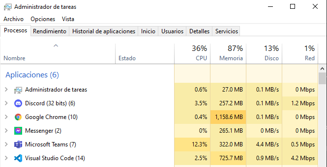

# ¿Qué son los programas residentes?🤔

Un programa residente es un programa que permanece en la memoria del ordenador, por eso hablamos de programas residentes en memoria. Cualquier aplicación que uses en tu ordenador  ocupa cierta cantidad de memoria pero cuando cierras el programa la memoria se libera y puede ser utilizada para otro fin. Los programas residentes permanecen todo el tiempo en memoria, aunque no estés utilizándolo en ese momento y por tanto ocupan permanentemente una porción de la memoria de tu ordenador.

Por ejemplo:
